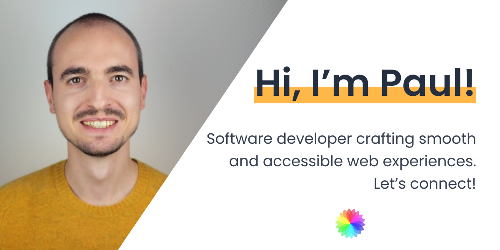

<!-- PROJECT LOGO -->
<br />
<p align="center">
  <a href="https://github.com/paulgaumer/v3_portfolio">
    
  </a>

  <h3 align="center">Paul Gaumer's Portfolio</h3>

  <p align="center">
    My personal website & portoflio
    <br />
    <br />
    <a href="https://paulgaumer.com/">View Website</a>
    ·
    <a href="https://www.paulgaumer.com/#contact-form">Report Bug</a>
    ·
  </p>
</p>

<!-- TABLE OF CONTENTS -->

## Table of Contents

- [About the Project](#about-the-project)
  - [Built With](#built-with)
- [Getting Started](#getting-started)
  - [Installation](#installation)
- [Contact](#contact)

<!-- ABOUT THE PROJECT -->

## About The Project

Personal website, portfolio and blog. Mostly a sandbox to explore new programming topics.

### Built With

- [Gatsby.js](https://www.gatsbyjs.com/) - front-end
- [Sanity](https://www.sanity.io/) - back-end ([Lien vers repo](https://github.com/paulgaumer/portfolio_sanity))
- [Netlify](https://netlify.com) - hosting
- [TypeScript](https://www.typescriptlang.org/)
- [Tailwind CSS](https://tailwindcss.com)
- [Styled Components](https://styled-components.com/)
- [Framer Motion](https://www.framer.com/motion/)
- [Cypress](https://www.cypress.io/) - testing

<!-- GETTING STARTED -->

## Getting Started

If you'd like to contribute or just run the website to understand its code:

### Installation

1. Clone the repo

```sh
git clone git@github.com:paulgaumer/v3_portfolio.git
```

2. Install NPM packages

```sh
yarn install
```

3. Start your local Gatsby server

```sh
gatsby develop
```

### Environment variables

The following variables are needed:

- `GATSBY_GOOGLE_ANALYTICS_ID` from [Google Analytics](https://analytics.google.com/)
- `GATSBY_SANITY_PROJECT_ID` from [Sanity](https://www.sanity.io/)

<!-- CONTACT -->

## Contact

[Paul Gaumer](https://paulgaumer.com) - [@PaulGaumer](https://twitter.com/@PaulGaumer) - hello@paulgaumer.com

Project Link: [https://github.com/paulgaumer/v3_portfolio](https://github.com/paulgaumer/v3_portfolio)
